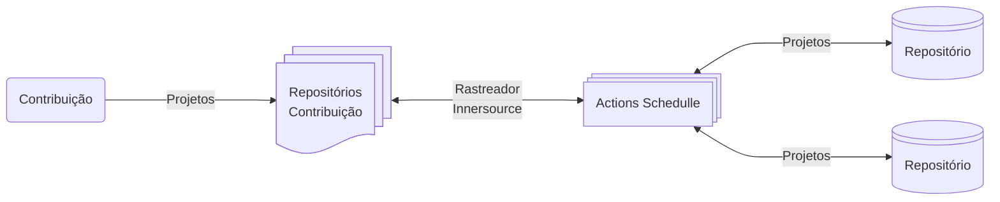

# Portal de Contribuições
O portal ainda é uma ideia.. Mas segue o jogo..

O botão "+" no canto inferior direito explica como listar novos projetos e como criar o arquivo de metadados InnerSource que contém informações adicionais sobre o projeto.
Requisitos

- [x] Instale o nodejs.
- [x] npm install
- [x] Executar o portal do projeto em um servidor web local (npm start ou npm run server)

## Listando Projetos
Adicionar seu projeto a este portal é tão fácil quanto adicionar o inner-source tópico ao seu repositório. 

Para personalizar as informações sobre seu projeto que são exibidas no portal, você pode, opcionalmente, adicionar um innersource.json arquivo. 

Para ver todas as opções disponíveis, verifique a Listing Documentation.

## Limitações
O portal foca em projetos InnerSource localizados no GitHub. 

Projetos que usam outros sistemas de gerenciamento de código-fonte podem ser exibidos no portal usando APIs semelhantes ou adicionando-os manualmente ao arquivo repos.json.

## Atualização
Os metadados do repositório mostrados neste portal são lidos de um arquivo estático `repos.json`.

Em um ambiente produtivo, você provavelmente precisará executar seu próprio rastreador para preencher repos.json com os projetos do InnerSource que deseja mostrar no seu portal.

A figura abaixo mostra o relacionamento entre rastreador, portal e repositórios. 

Assumimos que os repositórios estão localizados em uma ou mais instâncias do GitHub e usam a API do GitHub para buscar metadados do repositório. 

Se estiver usando um sistema de gerenciamento de código-fonte diferente, você pode preencher a estrutura descrita abaixo com os dados disponíveis desse sistema.

A pontuação de atividade do repositório é um valor numérico que representa a atividade  de um projeto InnerSource. 

Ela é derivada automaticamente de estatísticas de repositório como GitHub stars, watches e forks e pode ser enriquecida com KPIs de outras ferramentas ou avaliações manuais.

Além disso, ele considera parâmetros de atividade como última atualização e data de criação do repositório para dar um impulso a projetos jovens com muita tração. Projetos com diretrizes de contribuição, estatísticas de participação ativa e problemas (backlog público) também recebem uma classificação mais alta.

Tudo isso pode ser buscado e calculado automaticamente usando o conjunto de resultados da API de pesquisa do GitHub e da API de estatísticas do GitHub. 

Outros sistemas de controle de versão de código como Bitbucket, GitLab, Gerrit, Azure também podem ser integrados se uma API semelhante estiver disponível.

Acesso as [APIs GitHub](https://docs.github.com/en/rest/metrics/statistics?apiVersion=2022-11-28)

## APIs utilizadas

- [x] Informações do Repositório : `"https://api.github.com/repos/{owner}/{repo}"`
- [x] Informações dos Commits.   : `"https://api.github.com/repos/{owner}/{repo}/commits?since={data_inicio}&until={data_termino}"`
